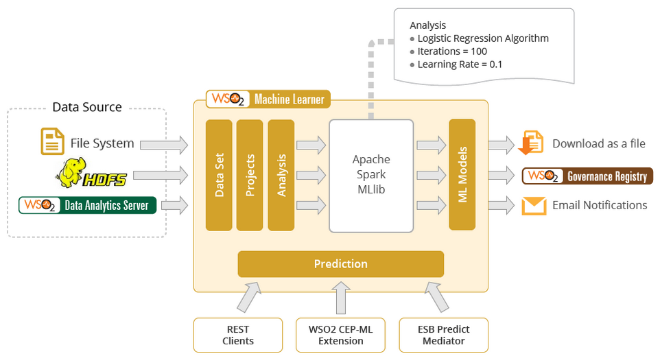

<!--
  ~  Copyright (c) 2014, WSO2 Inc. (http://wso2.com) All Rights Reserved.
  ~
  ~  WSO2 Inc. licenses this file to you under the Apache License,
  ~  Version 2.0 (the "License"); you may not use this file except
  ~  in compliance with the License.
  ~  You may obtain a copy of the License at
  ~
  ~    http://www.apache.org/licenses/LICENSE-2.0
  ~
  ~  Unless required by applicable law or agreed to in writing,
  ~  software distributed under the License is distributed on an
  ~  "AS IS" BASIS, WITHOUT WARRANTIES OR CONDITIONS OF ANY
  ~  KIND, either express or implied.  See the License for the
  ~  specific language governing permissions and limitations
  ~  under the License.
  -->

WSO2 Machine Learner (ML)
================================================================================

Welcome to the WSO2 Machine Learner 

WSO2 Machine Learner provides a user friendly wizard like interface, which guides users through
a set of steps to find and configure machine learning algorithms. The outcome of this process is a
model that can be deployed in multiple WSO2 products, such as WSO2 Enterprise Service Bus (ESB),
WSO2 Complex Event Processor (CEP). WSO2 ML can be integrated with WSO2 Data Analytics Server (DAS) in order to analyse summarized published data.
This is based on the revolutionary WSO2 Carbon framework.
All the major features have been developed as pluggable Carbon
components.

Overview
========

Key Features of WSO2 Machine Learner
====================================

1. Data exploration
2. Model generation
3. Model comparison
4. Prediction

System Requirements
===================

1. Minimum memory - 256MB
2. Processor      - Pentium 800MHz or equivalent at minimum
3. The Management Console requires full Javascript enablement of the
   Web browser
   NOTE:
     On Windows Server 2003, it is not allowed to go below the medium
     security level in Internet Explorer 6.x.

Documentation
=============

WSO2 ML documentation can be found at https://docs.wso2.com/display/ML100/WSO2+Machine+Learner+Documentation

Installation & Running
==================================

1. Extract the wso2ml-1.0.0-SNAPSHOT.zip and go to the extracted directory
2. Run the wso2server.sh or wso2server.bat as appropriate
3. Point your favourite browser to

    https://localhost:9443/ml

4. Use the following username and password to login

    username : admin  
    password : admin

WSO2 Machine Learner 1.0.0-SNAPSHOT distribution directory structure
===========================================================

	CARBON_HOME
		|- bin <folder>
		|- dbscripts <folder>
		|- lib <folder>
		|- repository <folder>
			|-- logs <folder>
		|--- conf <folder>
		|--- database <folder>
		|- resources <folder>
		|- samples <folder>
		|- tmp <folder>
		|- LICENSE.txt <file>
		|- README.txt <file>
		|- INSTALL.txt <file>		
		|- release-notes.html <file>

    - bin
	  Contains various scripts .sh & .bat scripts

    - conf
	  Contains configuration files

    - database
          Contains the database

    - dbscripts
          Contains all the database scripts

    - lib
	  Contains the basic set of libraries required to startup Machine Learner
	  in standalone mode

	- repository
	  The repository where services and modules deployed in WSO2 Machine Learner
	  are stored. In addition to this the components directory inside the
	  repository directory contains the carbon runtime and the user added
	  jar files including mediators third party libraries and so on..

	- logs
	  Contains all log files created during execution

	- resources
	  Contains additional resources that may be required, including sample
	  configuration and sample resources

	- samples
	  Contains some sample services and client applications that demonstrate
	  the functionality and capabilities of WSO2 Machine Learner

	- tmp
	  Used for storing temporary files, and is pointed to by the
	  java.io.tmpdir System property

	- LICENSE.txt
	  Apache License 2.0 and the relevant other licenses under which
	  WSO2 Machine Learner is distributed.

	- README.txt
	  This document.

    - INSTALL.txt
      This document will contain information on installing WSO2 Machine Learner

	- release-notes.html
	  Release information for WSO2 Machine Learner 1.0.0-SNAPSHOT

Support
=======

WSO2 Inc. offers a variety of development and production support
programs, ranging from Web-based support up through normal business
hours, to premium 24x7 phone support.

For additional support information please refer to http://wso2.com/support/

For more information on WSO2 Machine Learner, visit the WSO2 Oxygen Tank (http://wso2.org)

Issue Tracker
=============

  https://wso2.org/jira/browse/ML
  
  https://wso2.org/jira/browse/CARBON

Crypto Notice
=============

   This distribution includes cryptographic software.  The country in
   which you currently reside may have restrictions on the import,
   possession, use, and/or re-export to another country, of
   encryption software.  BEFORE using any encryption software, please
   check your country's laws, regulations and policies concerning the
   import, possession, or use, and re-export of encryption software, to
   see if this is permitted.  See <http://www.wassenaar.org/> for more
   information.

   The U.S. Government Department of Commerce, Bureau of Industry and
   Security (BIS), has classified this software as Export Commodity
   Control Number (ECCN) 5D002.C.1, which includes information security
   software using or performing cryptographic functions with asymmetric
   algorithms.  The form and manner of this Apache Software Foundation
   distribution makes it eligible for export under the License Exception
   ENC Technology Software Unrestricted (TSU) exception (see the BIS
   Export Administration Regulations, Section 740.13) for both object
   code and source code.

   The following provides more details on the included cryptographic
   software:

   Apache Rampart   : http://ws.apache.org/rampart/  
   Apache WSS4J     : http://ws.apache.org/wss4j/  
   Apache Santuario : http://santuario.apache.org/  
   Bouncycastle     : http://www.bouncycastle.org/  
   
(c) Copyright 2014 WSO2 Inc.

